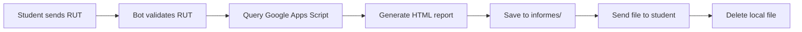
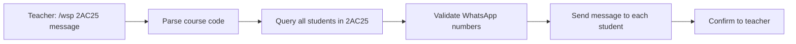

## Quick Setup

Get your bot running in just a few steps:

<Steps>
  <Step title="Start the Bot">
    Launch the application using npm:
    
    ```bash
    npm start
    ```
    
    You should see console output indicating both bots are initializing:
    
    ```text
    cliente telegram inicializado. ya se puede operar
    ```
  </Step>
  
  <Step title="Authenticate WhatsApp">
    On first launch, a QR code will appear in your terminal:
    
    ```text
    no habia sesion iniciada
    █████████████████████████████████
    █████████████████████████████████
    ██ ▄▄▄▄▄ █▀ █▀▀██ █ ▄▄▄▄▄ ██
    ██ █   █ █▀ ▄ ▄▀█ █ █   █ ██
    ██ █▄▄▄█ ██▄█ ▀▄  █ █▄▄▄█ ██
    [... QR code ...]
    █████████████████████████████████
    █████████████████████████████████
    se inicia sesion, por favor escanee el qr de arriba
    ```
    
    <Steps>
      <Step title="Open WhatsApp">
        Open WhatsApp on your smartphone
      </Step>
      
      <Step title="Go to Linked Devices">
        Tap **Menu** → **Linked Devices** (or Settings → Linked Devices)
      </Step>
      
      <Step title="Scan QR Code">
        Tap **Link a Device** and scan the QR code from your terminal
      </Step>
    </Steps>
    
    Once scanned, you'll see:
    
    ```text
    cliente whatsapp inicializado, ya se puede operar
    ```
    
    <Note>
      A `session` folder will be created to store your WhatsApp authentication. Future launches won't require QR scanning.
    </Note>
  </Step>
  
  <Step title="Verify Telegram Connection">
    Open Telegram and search for your bot by username (the one you created with BotFather).
    
    Send `/start` to your bot. You should receive:
    
    ```text
    Bienvenido, escribe *opciones* para saber lo que puedo hacer.
    El uso indebido del sistema implica bloqueo, baneo y otras posibles consecuencias
    ```
  </Step>
  
  <Step title="Test Basic Commands">
    Try the main menu command in either platform:
    
    **Telegram**: Type `opciones`  
    **WhatsApp**: Send `opciones` to the connected number
    
    You should receive the menu:
    
    ```text
    Elige o escribe según quieras:
    1.- Para pedir notas escribe 1
    2.- Para cambiar email de resultados de las pruebas escribe 2.
    3.- Para inscribirse quiero inscribirme o escribe 3 (SOLO si no te has inscrito antes)
    Escribe opciones para volver a ver este mensaje.
    ```
  </Step>
</Steps>

## First Interactions

### Student Commands

Try these common student interactions:

<CodeGroup>
```text Request Grades
# Student sends their RUT (no dots, no dashes)
123456789

# Bot responds
Alan Brito, espera un momento mientras reviso los datos.

# Bot sends HTML file with grades after ~10 seconds
📄 informe de notas solicitado por Alan Brito al 5_3_2026.html
```

```text Update Email
# Student sends
email

# Bot responds with instructions
Alan, debes escribir ahora tu rut sin puntos ni guion (Si termina en k reemplácelo por 1.) 
seguido de una coma y el nuevo email. Si es extranjero NO escriba el 100
ej: 123456781,nuevocorreo@gmail.com

# Student sends
123456789,student@example.com

# Bot processes the update
Alan Brito, cambio tu email a student@example.com ahora mismo, dame unos segundos para verificar tus datos
```

```text New Registration
# Student sends
inscribirme

# Bot sends template
Alan, debes REEMPLAZAR y ENVIAR los siguientes datos tal como se te indica.
NO BORRES MAS QUE LO NECESARIO
...
Estudiante,
Primer_Nombre: Alan,
2_Apellidos: Brito Delgado,
RUT: 12345678-5,
...
```
</CodeGroup>

### Teacher Commands

Teachers have access to special commands with the `/docente` prefix:

<CodeGroup>
```text Student Lookup
# Teacher sends
/docente

# Bot explains usage
Profesor(a) María, para solicitar los datos de algun estudiante debes usar el comando
/datos, un espacio y el rut del estudiante sin puntos ni guión...

# Teacher requests data
/datos 123456789

# Bot returns student info
Nombre: Alan Brito Delgado
Curso: 2AC25
Email: student@example.com
Teléfono: +56912345678
...
```

```text Course Broadcast
# Teacher sends course announcement
/wsp 2AC25 Recordatorio: Prueba de matemáticas mañana a las 10:00

# Bot confirms
Profesor(a) María, deme unos segundos para revisar los datos del mensaje a difundir

# Bot sends message to all students in course 2AC25
# After completion (~25 seconds)
He enviado el mensaje con lo que doy por finalizada su solicitud
```
</CodeGroup>

## Testing the Bot

### Verify Core Features

Test each major feature to ensure proper setup:

<Steps>
  <Step title="Menu System">
    **Command**: `opciones`  
    **Expected**: Menu with 3 options displayed
  </Step>
  
  <Step title="Grade Reports">
    **Command**: Enter a valid RUT (e.g., `123456789`)  
    **Expected**: HTML file sent after ~10 seconds  
    **Check**: `informes/` directory should be empty (files auto-deleted)
  </Step>
  
  <Step title="Email Update">
    **Command**: `email` then `RUT,newemail@example.com`  
    **Expected**: Confirmation message from Google Apps Script
  </Step>
  
  <Step title="Teacher Access">
    **Command**: `/docente`  
    **Expected**: Detailed instructions for teacher commands
  </Step>
</Steps>

## Admin Commands (WhatsApp Only)

As the admin (configured in `numeroAdmin`), you can manage user access:

```bash Admin Commands
# Add user to blacklist (block completely)
/addlistanegra 569XXXXXXXX John Doe

# Remove from blacklist
/removelistanegra 569XXXXXXXX

# View blacklist
/listalistanegra

# Add user to SimSimi whitelist (allow AI chat)
/addsimsimi 569XXXXXXXX Student Name

# Remove from SimSimi list
/removesimsimi 569XXXXXXXX

# View SimSimi whitelist
/listsimsimi
```

<Warning>
  Admin commands only work when sent from the WhatsApp number specified in `numeroAdmin` environment variable.
</Warning>

## Common Workflows

### Student Grade Request Flow



### Teacher Course Broadcast Flow



## Troubleshooting

### Bot Not Responding

<Steps>
  <Step title="Check console output">
    Look for error messages in the terminal where you ran `npm start`
  </Step>
  
  <Step title="Verify connections">
    Ensure you see both initialization messages:
    ```text
    cliente telegram inicializado. ya se puede operar
    cliente whatsapp inicializado, ya se puede operar
    ```
  </Step>
  
  <Step title="Test basic commands">
    Send `hola` - you should get a random greeting response
  </Step>
</Steps>

### WhatsApp QR Code Issues

- **QR code not appearing**: Check that `qrcode-terminal` package is installed
- **QR code expired**: Restart the bot with `npm start`
- **Already logged in elsewhere**: Log out of WhatsApp Web on other devices

### Google Apps Script Errors

```bash
Tuve problemas con tu solicitud. por: [error]. Intente de nuevo...
```

This indicates the Google Apps Script API is not responding:

- Verify `implementacionApiGoogle` in `.env`
- Check Google Apps Script deployment status
- Ensure script permissions are set to "Anyone"

## Running in Production

### Using PM2 (Recommended)

The `pm2` package is included in dependencies for production deployment:

```bash
# Install PM2 globally
npm install -g pm2

# Start the bot with PM2
pm2 start app.js --name preguntalealprofe

# View logs
pm2 logs preguntalealprofe

# Restart bot
pm2 restart preguntalealprofe

# Stop bot
pm2 stop preguntalealprofe
```

### Using Nodemon (Development)

```bash
# Start with auto-restart on file changes
npx nodemon app.js
```

## Next Steps

Now that your bot is running:

- **Configure Features**: Learn about [student features](/features/student) in detail
- **Teacher Tools**: Explore [teacher commands](/features/teacher) and workflows
- **Administration**: Set up [admin controls](/admin/user-management) for user management
- **Google Apps Script**: Understand the [backend integration](/integrations/google-apps-script)

<Tip>
  Keep your terminal window open to monitor bot activity and catch any errors in real-time during initial testing.
</Tip>